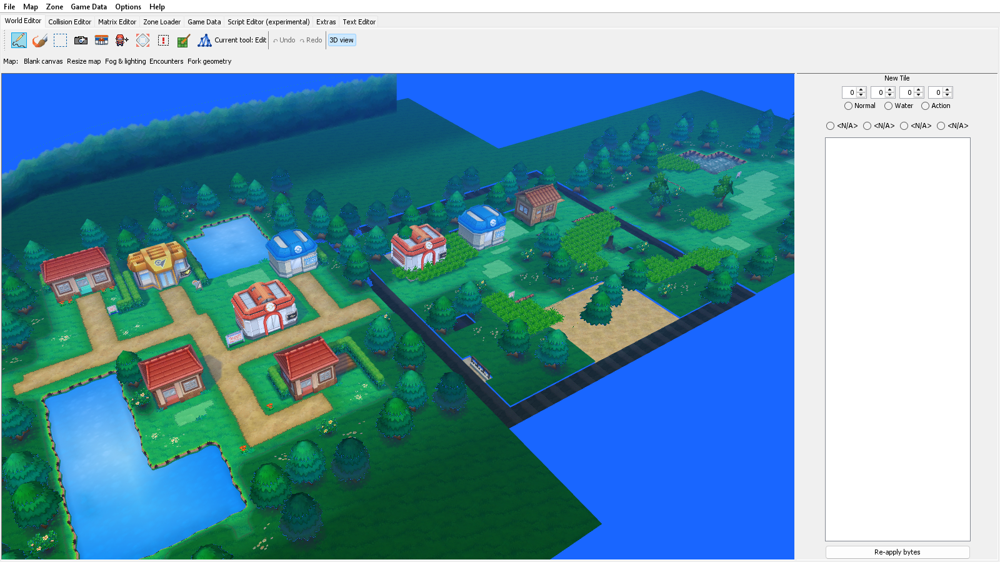
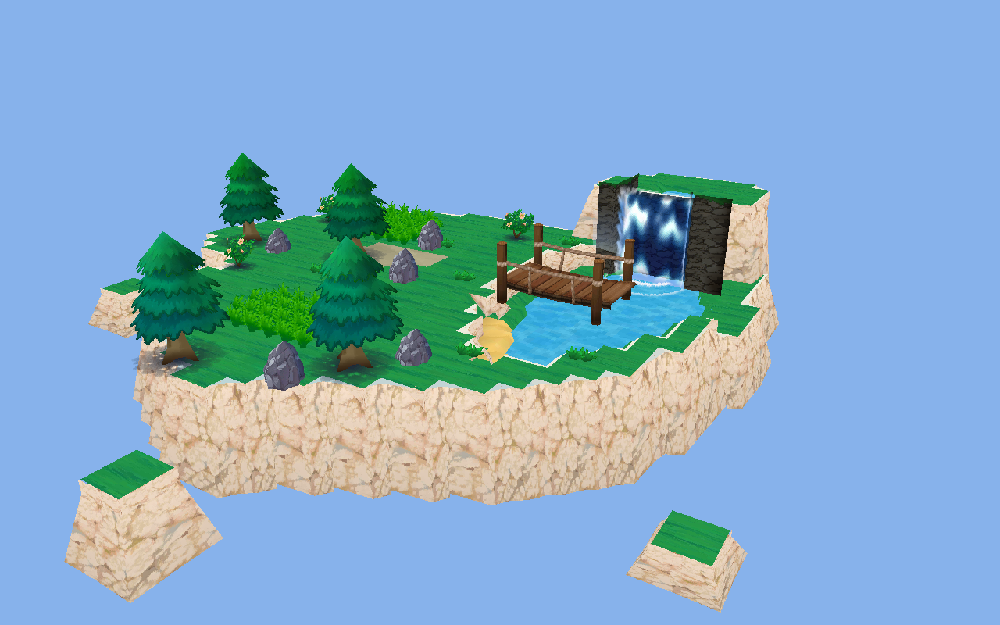
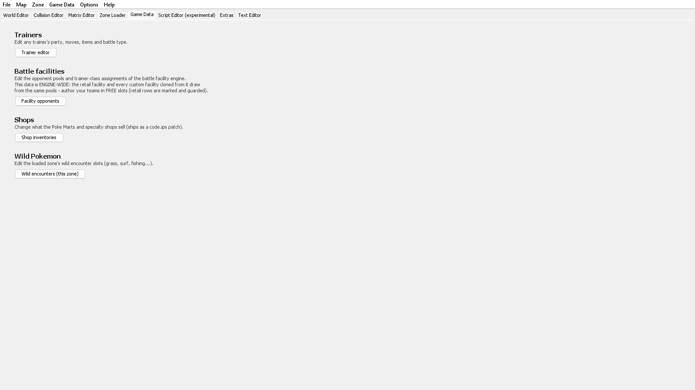

# CTRMap-F5

**A world editor for the Nintendo 3DS Pokémon games — Omega Ruby, Alpha Sapphire, X and Y.**

Build towns that were never in the game. Paint terrain, stamp buildings, place people and write
what they say, wire up doors, set the weather, edit trainers and shops — then play it.



*The editor's own 3D view, live, in the same window you edit in.*

CTRMap-F5 is a revival and major extension of [HelloOO7's CTRMap](https://github.com/HelloOO7)
(2019), continued in 2026 with one goal: make Gen 6 fan games as buildable as Gen 3 ones. The
"F5" edition is developed with Anthropic's Claude (Fable 5).

---

## ⚠️ You need your own copy of the game

**CTRMap contains no game files and cannot download them.** It edits a copy of a game *you own*,
which you unpack yourself from your own cartridge or eShop copy using a 3DS dumping tool.

Nothing in this repository is Nintendo's. No ROM data, no game assets, no music, no models —
none of it is included, and none of it ever will be. The screenshots on this page show the
editor operating on the author's own legally dumped copy.

Without your own unpacked game, CTRMap will open and do nothing. **The setup wizard walks you
through pointing it at one**, and tells you exactly what to look for.

---

## Install

Download the latest release from **[Releases](https://github.com/hdent1232/CTRMap-F5/releases)**:

| | |
|---|---|
| **`CTRMap-F5-x.y.z-windows-x64.zip`** | Unzip, double-click `CTRMap-F5.exe`. **No Java needed** — a runtime is included. Start here if you are not sure. |
| **`CTRMap-F5-x.y.z-portable.zip`** | Much smaller, but needs Java 8 or newer. Run `run.bat` (Windows) or `run.sh` (macOS/Linux). |

The first time you open it, a setup wizard appears. It finds your unpacked game (or hunts for
it), tells you which game it is, and — when you pick the wrong folder, which everyone does at
least once — tells you *what* you picked and where the right one is, rather than listing missing
archives at you.

You can re-run it any time from **Options → Setup wizard**.

---

## What it can do

### Build the world

- **Map Builder** — paint terrain with real brushes: grass, tall grass, path, sand, deep sand,
  water, waterfall, ice, cave, rock, ledges, stairs, bike rails, indoor floors and walkways.
  Every brush works on **every** map: if a map has no sand material, CTRMap imports a verified
  one from elsewhere in the game rather than refusing or painting garbage.
- **Edit in place** — paint onto a real map and keep everything you did not touch. The
  surrounding retail terrain, its collision and its detail stay exactly as they were.
- **Building palette** — **3,527 catalogued structures** harvested from the game: houses, marts,
  Pokémon Centers, gyms, signs, fences, doors. Search by name, preview, stamp. Textures the
  target map lacks are carried across automatically.
- **Blank canvas** — start a map from nothing instead of from someone else's town.



*Built from a blank canvas with the Map Builder: painted grass, water and cliffs, with trees, a
bridge and a waterfall stamped from the palette. Every texture and model here is the game's own —
CTRMap ships none of them, and cuts each one out of the copy you provide.*

- **Resize maps**, **fork geometry** so a cloned zone gets its own private copy, **fork areas**
  so lighting changes do not leak into every other map that shares them.

### Make it a place

- **Talking NPCs without scripting** — *Add talking NPC*, type the dialogue, done. Works in
  **all 536 zones**: the ones missing the message-display routine get it transplanted from the
  game's own code.
- **Dialogue editing** for existing NPCs, with a byte-faithful text codec.
- **Signs**, and **warps and doors** with full round-trip wiring between a building's exterior
  and its interior.
- **Wild encounters**, per zone, per slot.
- **Weather and atmosphere** — the game's own fog and lighting presets, applied per area.

### Game data



- **Trainers** — any trainer's party, moves, held items and battle type. 949 of them.
- **Battle facilities** — the Battle Maison's opponent pools and trainer-class lists, with
  retail rows marked and guarded so you author in free slots instead of overwriting the game.
- **Shops** — what every Poké Mart and specialty shop sells.
- **Custom battle facilities** — clone the Battle Institute into your own gauntlet, with your
  own trainers, your own streak counter and your own rewards.

### Under the hood

- **Live 3D view** in every mode, with the editor's own camera.
- **Zone cloning, appending and removal** — and a generated `code.ips` patch that lifts ORAS's
  536-zone limit when you need more.
- **Script trigger editing** — the "step on this tile → run this" events, fully decoded.
- **Pawn script assembler/disassembler** with 801 engine functions resolved by name.
- **OBJ import/export** of map geometry and collision, for editing maps in Blender.
- **Deploy to emulator** — one click copies only what you actually changed into Azahar/Citra's
  mod folder, and switches the mod off again when you want the retail game back.
- **In-app updates** that replace the copy you have, rather than leaving a second one next to it.

---

## Is it going to break my game?

Every binary format writer is validated headlessly against a real ORAS dump: parse →
re-serialize must be **byte-identical**, and every surgical operation is dry-run across *every*
eligible zone in the game before it is allowed into the UI.

`test.ps1` runs **42 suites**. Current measured results:

| | |
|---|---|
| Zone entities, headers, text, prop registries, texture packs | byte-identical round-trip, 536/536 zones |
| Map geometry | 857 regions, 6,476,998 triangles verified |
| Collision | 899 files, verbatim + rebuild |
| Scripts | 536 zones, 30,426 engine calls resolved |
| Areas | 228/228 atmosphere round-trip |
| Trainers | 949/949 byte-identical |
| Compression | within 0.2% of the game's own |

Your game folder is never written to until you choose to save, and CTRMap keeps a pristine
backup of everything it can edit so it always knows what you actually changed.

---

## Building from source

No IDE required. Any JDK 17+ (it targets Java 8 bytecode); the JOGL jars are bundled.

```
powershell -ExecutionPolicy Bypass -File build.ps1
run.bat
```

A copy running from source never self-updates — it tells you to `git pull` and rebuild, so a
checkout is never overwritten by a release.

To cut a release (builds both downloads, their checksums, and prints the publish command):

```
powershell -ExecutionPolicy Bypass -File package.ps1 -Version 1.1.0
```

See [QUICKSTART.md](QUICKSTART.md) for a walkthrough, [ARCHITECTURE.md](ARCHITECTURE.md) for how
the code is laid out, and [TESTING.md](TESTING.md) for what is verified and how.

---

## Credits & license

- **HelloOO7** — the original CTRMap (2019), the foundation of everything here
- **gdkchan** — SPICA / Ohana3DS research the model and texture code descends from
- **Kaphotics and the pk3DS contributors** — decoded structures referenced under GPLv3
- F5-edition development driven by Claude (Fable 5, Anthropic), 2026

GPLv3, same as the original — see [LICENSE](LICENSE).

New 3D models can be authored with [SPICA](https://github.com/HelloOO7/SPICA).

**Bugs and questions:** [open an issue](https://github.com/hdent1232/CTRMap-F5/issues).
